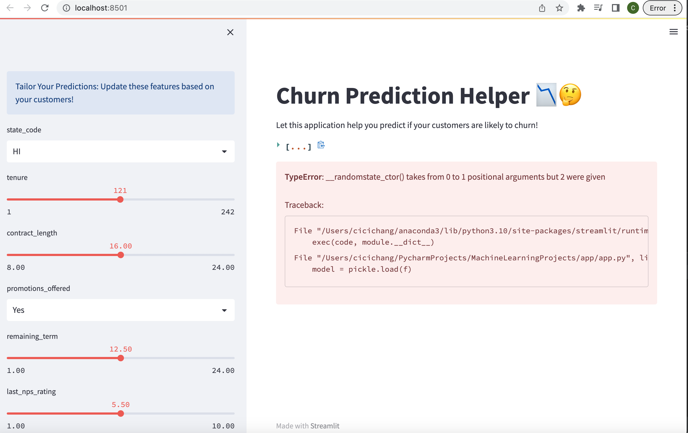

# Customer Churn Prediction Web App

## Classification Model Training

This repository contains the code and resources for training a classification model to predict customer churn. The model is built using various machine learning algorithms, and after evaluating their performance, the Gradient Boosting Classifier was selected due to its highest accuracy.

### Model Training Pipeline

The classification model training pipeline consists of the following algorithms:

- Stochastic Gradient Descent (SGD)
- Ridge Classifier
- Random Forest Classifier
- Gradient Boosting Classifier (selected algorithm)
- XGBoost Classifier

The pipelines are implemented using scikit-learn's `make_pipeline` function, and each pipeline includes a standardization step using `StandardScaler()` to preprocess the data before applying the respective algorithm.

## Web App Usage

To use the web app for customer churn prediction, follow the steps below:

1. Install the necessary dependencies by running the following command: pip install -r requirements.txt

2. Open a terminal and navigate to the `app` directory.

3. Run the following command to start the web app: streamlit run app.py

4. The web app will launch in your default browser and display a user interface.

5. Adjust the input features based on the customer's details, such as age, usage patterns, satisfaction scores, etc., using the provided input fields and sliders.

6. Click the "Predict" button to obtain the churn probability for the customer based on the selected features.

7. The web app will display the churn probability, indicating whether the customer is likely to churn or not. It will also present a graphical representation of all the tested customers and their corresponding churn results.

**Note:** The graph will dynamically update as you change the input features and click the "Predict" button.

## Deployment

Please note that this web app is designed as a local deployment and is not publicly accessible on the internet. To deploy and run the app locally, follow these steps:

1. Download and install Visual Studio Code (VS Code) from the official website: https://code.visualstudio.com/

2. Open VS Code and navigate to the project folder.

3. Install the required dependencies by running the following command in the VS Code terminal: pip install -r requirements.txt

4. Navigate to the `app` folder within the project directory.

5. Open the `app.py` file in VS Code by running the following command in the terminal: code .

6. In the VS Code terminal, run the following command to start the web app: streamlit run app.py

7. The web app will launch in your default browser, and you can use it locally for predicting customer churn based on the provided features.

## Final Web Page Demonstration

Feel free to reach out for any questions or concerns.

